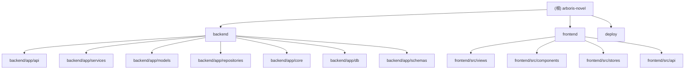

# Arboris-Novel — CLAUDE.md

> 变更记录 (Changelog)
> - 2026-04-18 20:35:46 — 初次生成，阶段 A/B 全量扫描

---

## 项目愿景

Arboris 是一款面向创作者的 AI 写作辅助工具，聚焦于帮助作者理清思路、管理设定（角色 / 地点 / 派系）、生成主线大纲，并通过多版本对比逐步让模型贴近作者笔触。在线体验：https://arboris.aozhiai.com

---

## 架构总览

单体 Monorepo，前后端共存于同一仓库，通过 Docker 多阶段构建打包成一个镜像，nginx 反向代理前端静态资源并将 `/api` 流量转发至 uvicorn。

```
                    Browser
                       |
                    nginx :80
                   /        \
          静态文件(dist)   /api/* → uvicorn :8000
                                   |
                              FastAPI App
                          ┌────────┼──────────┐
                       Routers  Services  Repositories
                                   |
                          ┌────────┴─────────┐
                       SQLite / MySQL     libsql (向量库)
```

核心写作流程采用三层架构：
- **L1 Planner** — 全知规划层（蓝图 / 大纲），对全体信息可见
- **L2 Director** — 章节导演脚本（ChapterMission），控制每章节拍
- **L3 Writer** — 有限视角正文生成，只暴露已登场角色

RAG 检索通过 `VectorStoreService`（libsql）提供相似剧情片段与章节摘要。

---

## 模块结构图



---

## 模块索引

| 模块路径 | 语言 | 职责一句话 |
|---|---|---|
| `backend/` | Python 3.11 | FastAPI 后端，提供所有 REST API，封装 AI 写作业务逻辑与数据持久化 |
| `frontend/` | TypeScript / Vue 3 | Vite + Vue 3 + Naive UI 前端，实现写作台、大纲编辑、角色管理等交互界面 |
| `deploy/` | Docker / Shell | 多阶段 Dockerfile、nginx、supervisor、docker-compose 一键部署配置 |

---

## 运行与开发

### 快速启动（Docker，默认 SQLite）

```bash
cd deploy
cp .env.example .env
# 至少修改 SECRET_KEY 和 OPENAI_API_KEY
docker compose up -d
# 默认访问 http://localhost:8088
```

### 使用 MySQL

```bash
DB_PROVIDER=mysql docker compose --profile mysql up -d
```

### 本地开发

**后端**

```bash
cd backend
python -m venv .venv && source .venv/bin/activate
pip install -r requirements.txt
# 创建 .env（参考 deploy/.env.example）
uvicorn app.main:app --reload --port 8000
```

**前端**

```bash
cd frontend
npm install
npm run dev          # Vite dev server :5173，代理 /api → :8000
npm run build        # 构建 dist/
npm run type-check   # TypeScript 类型检查
```

### 关键环境变量

| 变量 | 必须 | 说明 |
|---|---|---|
| `SECRET_KEY` | 是 | JWT 加密密钥，生产须随机化 |
| `DB_PROVIDER` | 否 | `sqlite`（默认）或 `mysql` |
| `OPENAI_API_KEY` | 是 | LLM API 密钥，兼容 OpenAI 规范的任意服务 |
| `OPENAI_API_BASE_URL` | 否 | 默认 `https://api.openai.com/v1` |
| `OPENAI_MODEL_NAME` | 否 | 默认 `gpt-4o-mini` |
| `EMBEDDING_PROVIDER` | 否 | `openai` 或 `ollama` |
| `VECTOR_DB_URL` | 否 | libsql 向量库路径，未配置则 RAG 不可用 |

---

## 测试策略

- 单元 / 集成测试极少，仅有 `backend/app/services/test_phase4_integration.py` 一个探索性集成测试文件。
- 无 CI pipeline 配置（无 `.github/workflows`）。
- **建议补充**：为 `pipeline_orchestrator`、`llm_service`、`novel_service` 编写 pytest 单元测试；前端补充 vitest 组件测试。

---

## 编码规范

### 后端

- Python 3.11，SQLAlchemy 2.0 异步 ORM，FastAPI 0.110
- Pydantic v2 数据验证，`pydantic-settings` 管理配置
- Repository 模式分层：Router → Service → Repository → Model
- 所有数据库操作使用 `async/await`，Session 由 FastAPI 依赖注入

### 前端

- Vue 3 Composition API + `<script setup>` 风格
- Pinia 状态管理，vue-router 4 导航守卫权限控制
- Naive UI 组件库 + TailwindCSS 4 样式
- 原生 `fetch` 封装 HTTP 客户端（无 axios）

---

## AI 使用指引

- 修改 `pipeline_orchestrator.py` 前必须完整阅读 `PipelineConfig` dataclass，所有特性开关均在此定义。
- 新增 API 路由需在 `backend/app/api/routers/__init__.py` 中注册。
- 提示词由 `PromptService` 统一管理，存于数据库，不要在服务层硬编码提示词。
- 前端 API 调用统一经由 `frontend/src/api/novel.ts` 的 `request()` 函数，已处理 401 自动跳转。
- 向量检索依赖 `libsql-client`，本地开发可通过 `VECTOR_DB_URL=file:./storage/rag_vectors.db` 启用本地文件模式。
